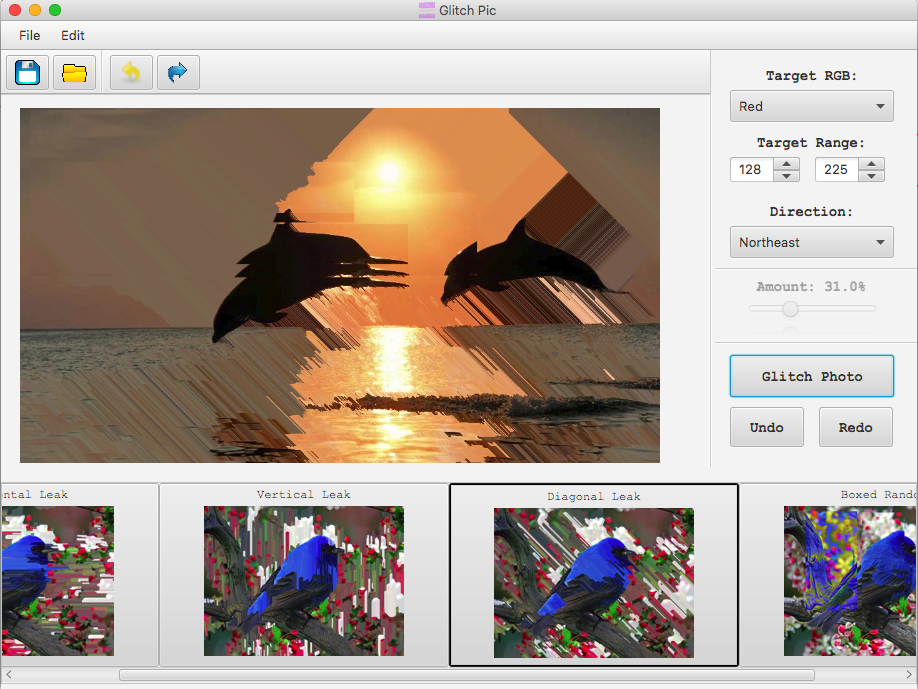

# Glitch Pic

Glitch Pic is a photo manipulation desktop app that allows users to easily transform any of their photos into glitch art. Users
are able to specify the RGB values and direction or amount of the glitch effect they want applied to their photo, and they are
able to step through the process and save their glitched result to their device. It provides users with a simple and easy way
to make creative photos without having to use software like Photoshop.

## Contributing

Contributions are always welcome!

## Author

* **Stanford Chastain** 
